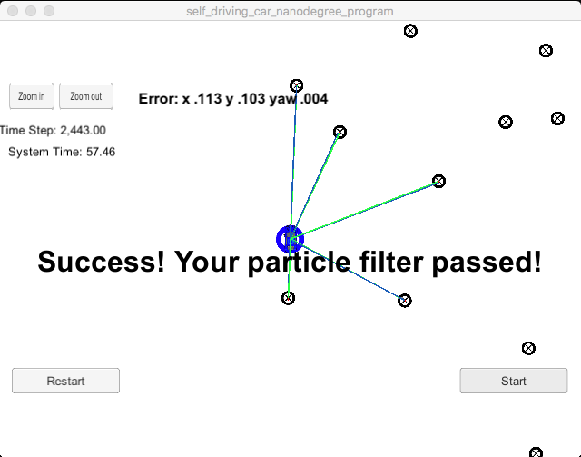

# Kidnapped Vehicle Project - Jose C. Marti
Self-Driving Car Engineer Nanodegree Program

This is the third project of the Term 2.
In this project I have implemented a 2 dimensional particle filter in C++. The program will be given a map and some initial localization information. At each time step it will also get observation and control data.
 
## Compiling

The code compiles without errors with cmake and make.

## Success Criteria

The particle filter passes the current grading code in the simulator. The things the grading code is looking for are:

    Accuracy: the particle filter localizes vehicle position and yaw to within the values specified in the parameters max_translation_error and max_yaw_error in src/main.cpp.

    Performance: the particle filter completes execution within the time of 100 seconds.

## Comments

The theory behind this project is exciting and interesting. I never though in college that, the simple statement of the Bayes theorem, could become so powerful for such a complex applications. In practice, translating this knowledge into C++ language has taken me longer than expected and I had to recourse to the Udacity Walkthrough videos for additional support.
